# Nav2 Navigation Scenario (Tiago Pro)

Docker container for running Nav2 navigation stack with Tiago Pro robot connected to Isaac Sim.

## Table of Contents

- [Nav2 Navigation Scenario (Tiago Pro)](#nav2-navigation-scenario-tiago-pro)
  - [Table of Contents](#table-of-contents)
  - [Overview](#overview)
  - [Package Components](#package-components)
    - [Controllers](#controllers)
    - [Nav2 Launch](#nav2-launch)
    - [Simple Commander Usage](#simple-commander-usage)
  - [CI/CD Workflow](#cicd-workflow)
    - [Step 1: Access Dashboard and Create Project](#step-1-access-dashboard-and-create-project)
    - [Step 2: Configure Repository](#step-2-configure-repository)
    - [Step 3: Select Branch](#step-3-select-branch)
    - [Step 4: Configure Docker](#step-4-configure-docker)
    - [Step 5: Review and Create](#step-5-review-and-create)
    - [Step 6: Upload Robot and Scene Files](#step-6-upload-robot-and-scene-files)
    - [Step 7: Create Test Case](#step-7-create-test-case)
    - [Step 8: Configure Test Scenario](#step-8-configure-test-scenario)
    - [Step 9: Run Test](#step-9-run-test)

## Overview

```bash
cd dockers/navigation_docker
./run_navigation_example.sh --build
```

Container starts two launch files sequentially:
1. `tiago_isaac_bringup.launch.py` — robot controllers
2. `tiago_navigation.launch.py` — Nav2 stack

---

## Package Components

### Controllers

`ros2 launch tiago_pro_bringup tiago_isaac_bringup.launch.py`

Brings up ros2_control stack for Tiago Pro robot. Launch file performs following:

1. Starts `controller_manager` node with hardware interface configuration from `tiago_pro_description/ros2_control/gazebo_controller_manager_cfg.yaml`. This node manages all ros2_control controllers and communicates with Isaac Sim through topic-based hardware interface.

2. Spawns default controllers via `tiago_pro_controller_configuration/default_controllers.launch.py`. Controllers handle joint trajectories for arms, base velocity, head and gripper movements.

3. Launches `robot_state_publisher` from `tiago_pro_description` package. Publishes robot URDF to `/robot_description` topic and broadcasts TF transforms based on joint states.

4. Starts `twist_mux` node for velocity command multiplexing. Handles priority between different cmd_vel sources (navigation, joystick, etc.) based on configuration in `tiago_pro_bringup/config/twist_mux/`.

5. Launches `play_motion2` for predefined motion execution. Allows triggering named motions like "home", "wave", etc.

6. Starts `gripper_grasper` wrapper node for simplified gripper control interface.

### Nav2 Launch

`ros2 launch robot_navigation tiago_navigation.launch.py`

Wraps standard `nav2_bringup/bringup_launch.py` with Tiago-specific configuration. Launch arguments:

- `map` — path to map yaml file (default: `robot_navigation/maps/warehouse.yaml`)
- `params_file` — navigation parameters (default: `robot_navigation/params/tiago_navigation_params.yaml`)
- `use_sim_time` — use simulation clock (default: `true`)
- `use_rviz` — launch RViz visualization (default: `false`)

Maps are located in `humble_ws/src/robot_navigation/maps/`:
- `warehouse.yaml` / `warehouse.png` — main warehouse map (0.05m resolution)
- `warehouse_navigation.yaml` / `warehouse_navigation.png` — alternative warehouse map
- `warehouse_with_tiago.yaml` / `warehouse_with_tiago.png` — warehouse with robot included

Navigation stack components started:

1. **Map Server** — loads occupancy grid from warehouse map yaml/png files. Map has 0.05m resolution.

2. **AMCL** — Adaptive Monte Carlo Localization using `nav2_amcl::OmniMotionModel` for omnidirectional base. Uses front lidar `/TiagoPro/TIM781_front/scan` for particle filter updates. Configured with 500-2000 particles, global frame `world`, odom frame `odom`.

3. **Planner Server** — global path planning using `nav2_navfn_planner/NavfnPlanner` (Dijkstra algorithm). Tolerance 0.5m, allows planning through unknown space.

4. **Controller Server** — local path following using `nav2_regulated_pure_pursuit_controller::RegulatedPurePursuitController`. Desired linear velocity 0.8 m/s, lookahead distance 0.6m, max angular velocity 1.8 rad/s. Simple and reliable path tracking for omnidirectional base.

5. **Behavior Server** — recovery behaviors: spin, backup, wait, drive_on_heading. Activated when robot gets stuck or path is blocked.

6. **Smoother Server** — path smoothing using `nav2_smoother::SimpleSmoother`.

7. **Waypoint Follower** — multi-goal navigation with `WaitAtWaypoint` task executor (200ms pause at each waypoint).

8. **Velocity Smoother** — smooths velocity commands to prevent jerky motion. Max velocity [1.0, 0.0, 1.9], max acceleration [3.0, 0.0, 3.0].

9. **BT Navigator** — behavior tree based navigation using default `navigate_to_pose_w_replanning_and_recovery.xml`. Global frame `world`, robot frame `base_link`, uses odometry from `/TiagoPro/odom`.

10. **Lifecycle Manager** — manages node lifecycle transitions (configure, activate, deactivate, cleanup).

Costmap configuration:

- **Local Costmap** — 3x3m rolling window, 0.05m resolution. Uses voxel layers for both front (`/TiagoPro/TIM781_front/scan`) and rear (`/TiagoPro/TIM781_rear/scan`) lidars. Inflation radius 0.05m.

- **Global Costmap** — static map with obstacle layers for front and rear lidars. Inflation radius 0.1m. Robot footprint `[0.35, 0.24]` meters.

### Simple Commander Usage

Test script demonstrates nav2_simple_commander Python API:

```bash
ros2 run nav2_apps nav2_tiago_test
```

Implementation in `nav2_apps/nav2_apps/nav2_tiago_test.py` shows:

1. **Initialization** — create `BasicNavigator` instance, call `waitUntilNav2Active()` to wait for all Nav2 servers to become active.

2. **Initial Pose** — set robot starting position using `setInitialPose()`. Creates `PoseStamped` message with frame_id `world` and publishes to `/initialpose` topic for AMCL.

3. **Navigation** — call `goToPose()` with goal `PoseStamped`. Method sends goal to `/navigate_to_pose` action server.

4. **Feedback Loop** — poll `isTaskComplete()` and `getFeedback()` to monitor navigation progress. Feedback contains `distance_remaining` to goal.

5. **Result Handling** — check `getResult()` for `TaskResult.SUCCEEDED`, `CANCELED`, or `FAILED`.

Test executes square route through 4 waypoints: `(0,0) → (2,0) → (2,2) → (0,2) → (0,0)`

Available BasicNavigator methods:

| Method | Action Server | Description |
|--------|---------------|-------------|
| `goToPose(pose)` | `/navigate_to_pose` | Navigate to single goal |
| `followWaypoints(poses)` | `/follow_waypoints` | Sequential waypoint navigation |
| `goThroughPoses(poses)` | `/navigate_through_poses` | Navigate through intermediate poses |
| `getPath(start, goal)` | `/compute_path_to_pose` | Compute path without executing |
| `smoothPath(path)` | `/smooth_path` | Smooth computed path |

---

## CI/CD Workflow

### Step 1: Access Dashboard and Create Project

After logging into the system with your account, you will be redirected to the dashboard page. Click the "Start" button on the CI/CD application icon.

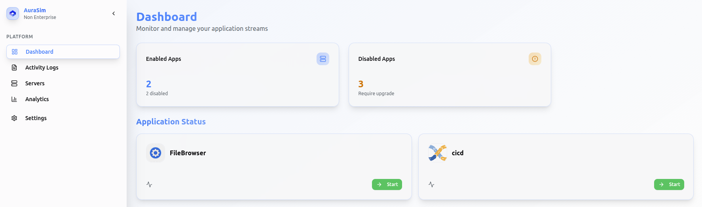

You will be presented with the projects page. Click "Create Project" button to start a new project.

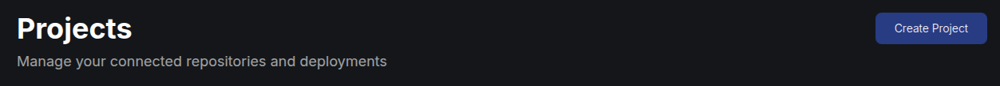

### Step 2: Configure Repository

In the project creation wizard, configure your repository settings:

1. **Project Name**: Enter project name (e.g., `tiago_nav2_test`)
2. **GitHub Repository**: Select your forked repository (`aurasim_ros_workspaces`)

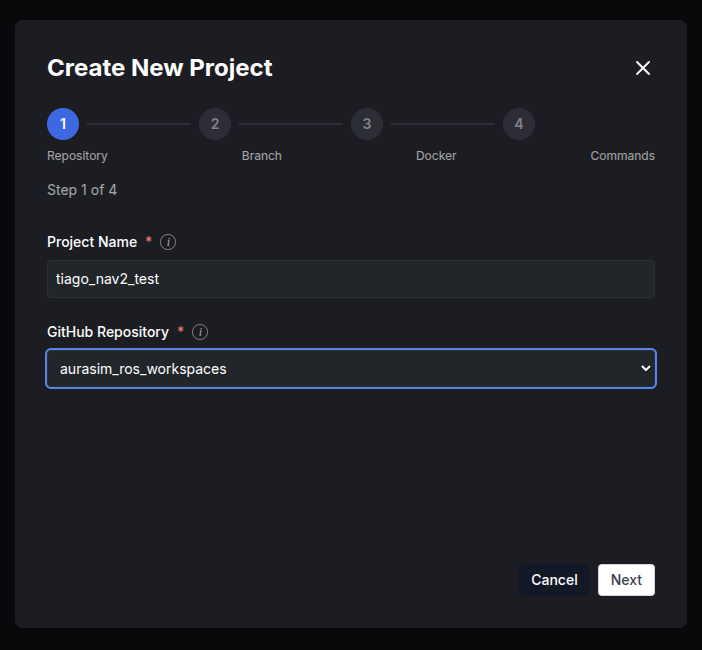

Click "Next" to proceed.

### Step 3: Select Branch

Choose the branch containing your navigation scenario (e.g., `feature/nav2_example_docker`).

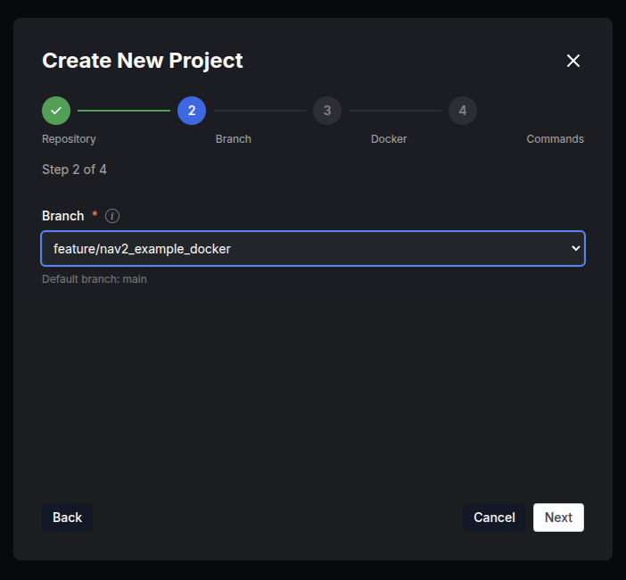

Click "Next" to continue.

### Step 4: Configure Docker

Select Docker configuration type and specify paths. You can choose between "Dockerfile" or "Docker Compose" depending on your setup:

1. **Docker Configuration Type**: Choose "Docker Compose" (or "Dockerfile" if using single container)
2. **Base Directory**: `/dockers/navigation_docker`
3. **Compose File Location**: `docker-compose-nav2.yml` (for Docker Compose) or `Dockerfile` (for Dockerfile)

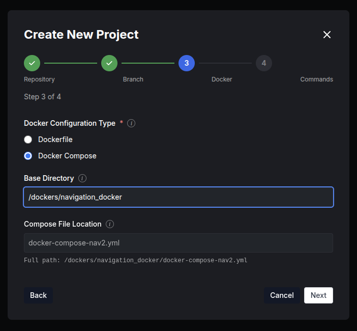

Click "Next" to proceed.

### Step 5: Review and Create

Review the project summary and Docker commands:

- **Build Command**: `cd dockers/navigation_docker && docker compose -f docker-compose-nav2.yml build`
- **Run Command**: `cd dockers/navigation_docker && docker compose -f docker-compose-nav2.yml up -d`

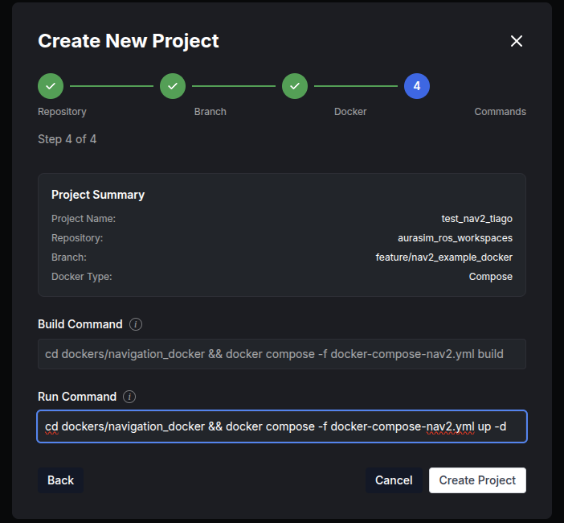

Click "Create Project" to finalize setup.

### Step 6: Upload Robot and Scene Files

After project creation, navigate to the project page and upload required files:

1. **Robot Model File**: Upload Tiago Pro USD file or select existing one

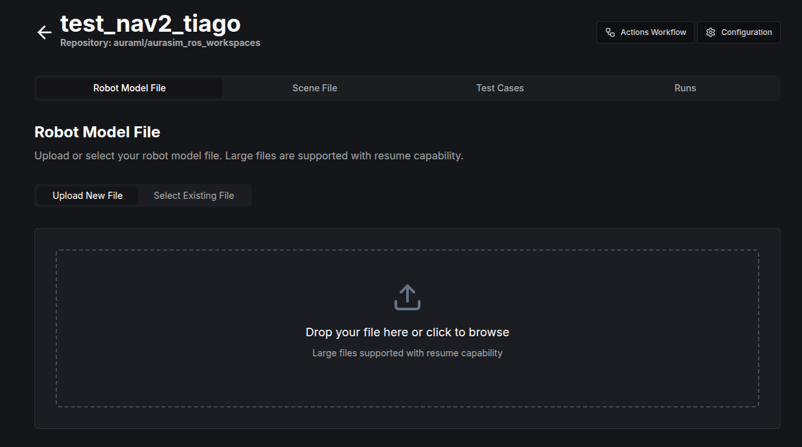

2. **Scene File**: Upload warehouse scene (`warehouse.usd` - 2.6 MB)

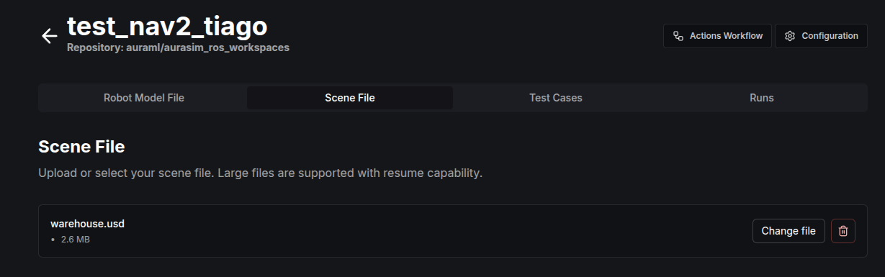

### Step 7: Create Test Case

Navigate to "Test Cases" tab and click "Create test case":

1. **Name**: `navifation_warehouse`
2. **Retries**: 1
3. **Retry delay**: 300 seconds
4. **Schedule**: None
5. **Catchup**: Enabled
6. **Concurrency**: 1
7. **Max active runs**: 1

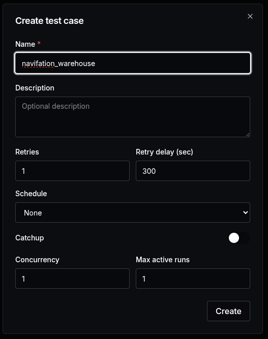

Click "Create" to proceed.

### Step 8: Configure Test Scenario

Build your test scenario using the node-based editor. This is a visual graph editor where you can create test workflows by connecting nodes.

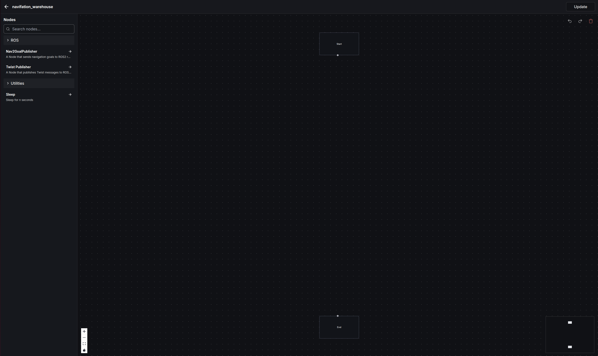

Create a simple navigation test:

1. Add "Start" node
2. Add "Nav2GoalPublisher" node with parameters:
   - `goal_x`: 10.0
   - `goal_y`: 0.0
   - `goal_z`: -0.0
   - `orientation_z`: 0.0
   - `orientation_w`: 1.0
   - `frame_id`: world
   - `action_topic`: /navigate_to_pose
   - `timeout`: 60.0
   - `wait_for_result`: True
3. Add "End" node
4. Connect nodes: Start → Nav2GoalPublisher → End

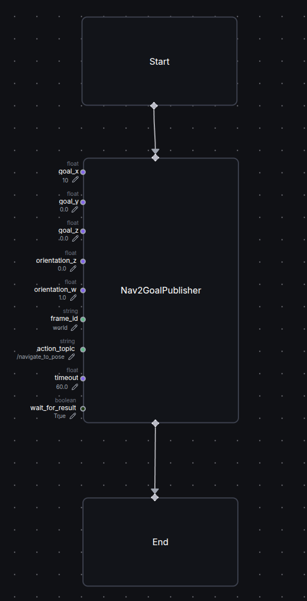

Click "Update" to save the scenario.

### Step 9: Run Test

Navigate to "Runs" tab and trigger the test execution. Monitor the console output for:

- Docker image building
- Container creation and startup
- Navigation stack initialization
- Test execution progress

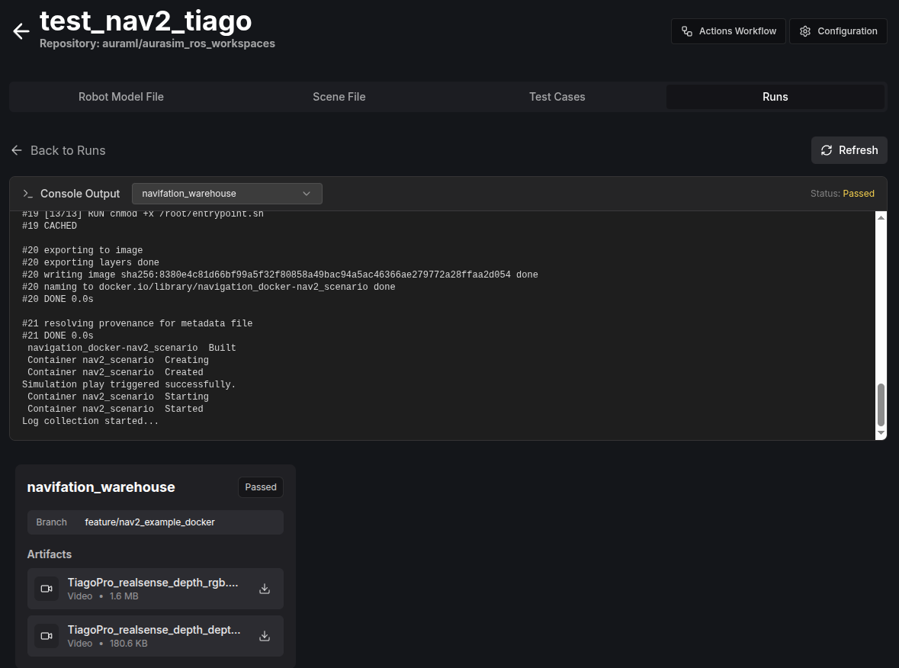

Test artifacts will be available after completion:
- Video recordings from robot cameras (depth sensor, RGB camera)
